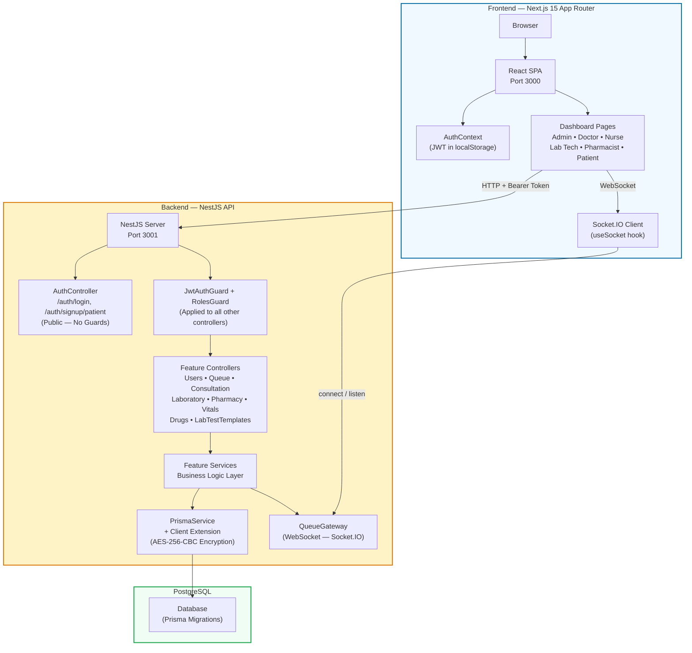

# System Architecture Overview

## Key Points

- **Frontend** is a Next.js 15 SPA (only `layout.tsx` is a Server Component)
- **Backend** is a NestJS monolith with 8 feature modules
- **Auth** uses JWT (Bearer token) with Passport strategy — all endpoints except `/auth/*` are guarded
- **Real-time** updates use Socket.IO (`queueUpdate` and `patientUpdate-{id}` events)
- **Prisma Client Extension** encrypts sensitive fields (`ConsultationNote.notes`, `LabTest.resultData`) at rest with AES-256-CBC
- **PostgreSQL** stores all persistent data with UUID primary keys