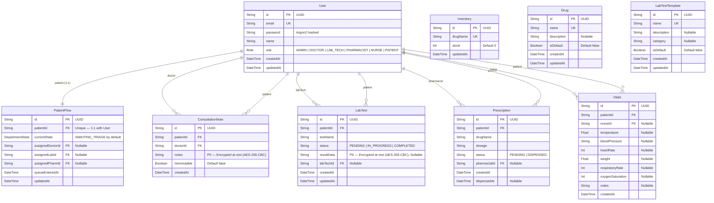

# Database Entity-Relationship Diagram

## Encryption Notes

Fields marked **"PII — Encrypted at rest"** are automatically encrypted/decrypted by the Prisma Client Extension using AES-256-CBC:

- **ConsultationNote.notes** — Doctor's clinical notes are encrypted before storage and decrypted on read
- **LabTest.resultData** — Lab test results are encrypted before storage and decrypted on read

The encryption uses a random 16-byte IV per write, stored in `iv:ciphertext` format. The encryption key comes from `ENCRYPTION_KEY` env var (with a hardcoded fallback).