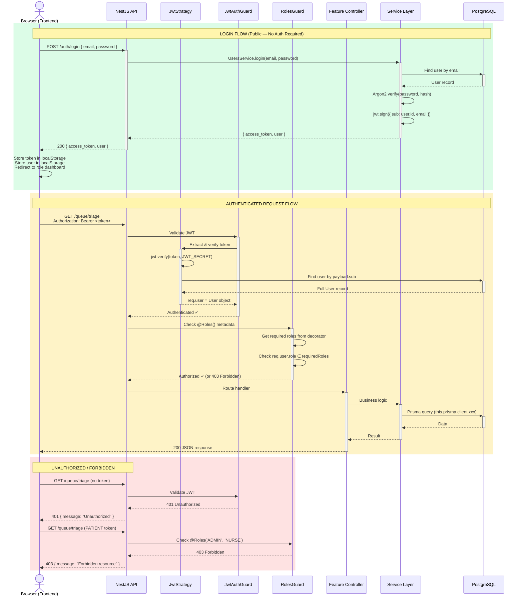

# Authentication & Authorization Flow

## Auth Details

| Aspect | Implementation |
|--------|---------------|
| **Password hashing** | Argon2 (`argon2.verify`) |
| **Token format** | JWT (`{ sub: userId, email }`) |
| **Token expiry** | 1 day (`expiresIn: '1d'`) |
| **Token storage** | `localStorage` on client |
| **Token transmission** | `Authorization: Bearer <token>` header |
| **JWT secret** | `JWT_SECRET` env var (fallback: `"SUPER_SECRET_KEY"`) |
| **Public routes** | `POST /auth/login`, `POST /auth/signup/patient` |
| **Guard order** | `JwtAuthGuard` → `RolesGuard` (on every protected controller) |
| **Role enum** | `ADMIN`, `DOCTOR`, `LAB_TECH`, `PHARMACIST`, `NURSE`, `PATIENT` |
| **@CurrentUser()** | Custom param decorator → extracts `req.user` (full User object) |