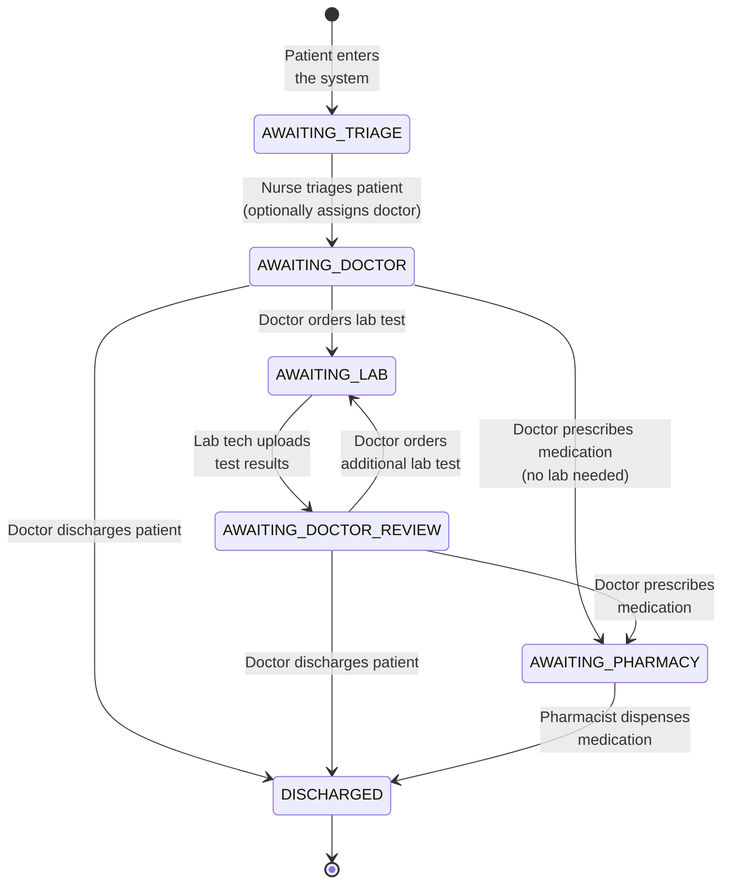

# Patient Flow State Machine

## State Transition Details

| From | To | Triggered By | Role Required | API Endpoint |
|------|----|-------------|---------------|-------------|
| `AWAITING_TRIAGE` | `AWAITING_DOCTOR` | Nurse completes triage | ADMIN, NURSE | `PUT /queue/advance/:patientId` |
| `AWAITING_DOCTOR` | `AWAITING_LAB` | Doctor orders lab test | ADMIN, DOCTOR | `PUT /queue/advance/:patientId` |
| `AWAITING_DOCTOR` | `AWAITING_PHARMACY` | Doctor prescribes drugs | ADMIN, DOCTOR | `PUT /queue/advance/:patientId` |
| `AWAITING_DOCTOR` | `DISCHARGED` | Doctor discharges | ADMIN, DOCTOR | `PUT /queue/advance/:patientId` |
| `AWAITING_LAB` | `AWAITING_DOCTOR_REVIEW` | Lab tech uploads results | ADMIN, LAB_TECH | `PUT /queue/advance/:patientId` |
| `AWAITING_DOCTOR_REVIEW` | `AWAITING_LAB` | Doctor orders more labs | ADMIN, DOCTOR | `PUT /queue/advance/:patientId` |
| `AWAITING_DOCTOR_REVIEW` | `AWAITING_PHARMACY` | Doctor prescribes | ADMIN, DOCTOR | `PUT /queue/advance/:patientId` |
| `AWAITING_DOCTOR_REVIEW` | `DISCHARGED` | Doctor discharges | ADMIN, DOCTOR | `PUT /queue/advance/:patientId` |
| `AWAITING_PHARMACY` | `DISCHARGED` | Pharmacist dispenses | ADMIN, PHARMACIST | `PUT /queue/advance/:patientId` |

### Side Effects During Transitions

When a patient advances through the flow, the `QueueService` also:

1. **Updates `PatientFlow` record** — sets `currentState` and timestamps
2. **Assigns staff IDs** — populates `assignedDoctorId`, `assignedLabId`, or `assignedPharmId` as appropriate
3. **Broadcasts WebSocket events** — emits `queueUpdate` (global) and `patientUpdate-{id}` (patient-specific) via `QueueGateway`
4. **All Queue queries** filter by the requesting user's role and assigned ID (e.g., doctors only see patients assigned to them)