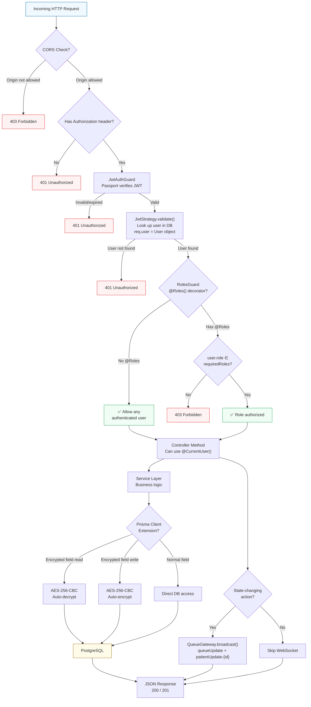

# API Request Flow (Guard & Middleware Pipeline)

## Pipeline Summary

1. **CORS** — Only `localhost:3000` and `127.0.0.1:3000` allowed (with credentials)
2. **JwtAuthGuard** — Extracts Bearer token, validates via Passport JWT strategy
3. **JwtStrategy.validate()** — Looks up full user from DB (includes encrypted fields)
4. **RolesGuard** — Checks `req.user.role` against `@Roles()` metadata
5. **@CurrentUser()** — Custom decorator making `req.user` available in handler
6. **Service → Prisma** — All DB access uses `this.prisma.client.xxx` (with encryption extension)
7. **QueueGateway** — After state-changing operations, broadcasts WebSocket events to connected clients