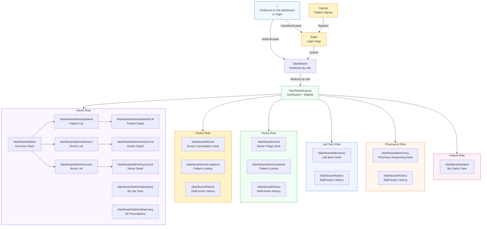

# Frontend Routing & Page Structure

## Role-to-Dashboard Mapping

| Role | Default Route | Accessible Pages |
|------|--------------|-----------------|
| **ADMIN** | `/dashboard/admin` | All admin pages + history |
| **DOCTOR** | `/dashboard/doctor` | Doctor desk, check-patients, history |
| **NURSE** | `/dashboard/nurse` | Nurse desk, check-patients, history |
| **LAB_TECH** | `/dashboard/laboratory` | Lab desk, history |
| **PHARMACIST** | `/dashboard/pharmacy` | Pharmacy desk, history |
| **PATIENT** | `/dashboard/patient` | My status only |