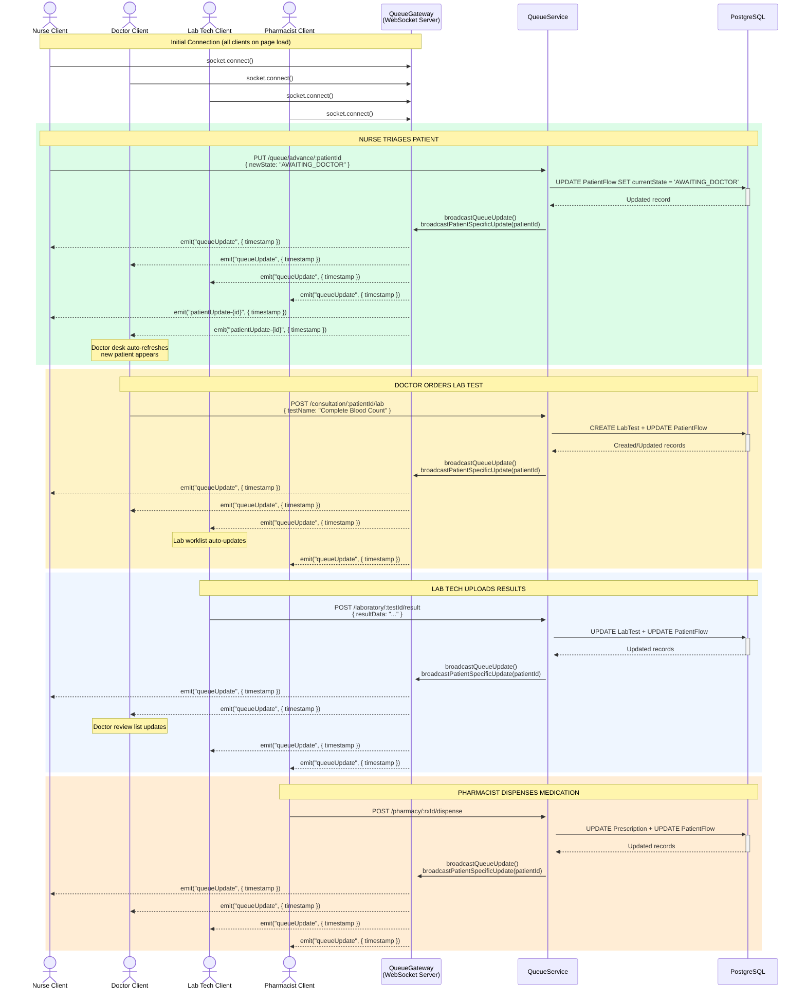

# Real-Time WebSocket Flow

## WebSocket Architecture

| Component | Detail |
|-----------|--------|
| **Library** | Socket.IO (server + client) |
| **Server** | `QueueGateway` — `@WebSocketGateway({ cors: { origin: '*' } })` |
| **Client** | `useSocket(patientId?)` hook — connects to `NEXT_PUBLIC_WS_URL` or `localhost:3001` |
| **Events** | `queueUpdate` (broadcast to all clients), `patientUpdate-{id}` (per-patient) |
| **Payload** | `{ timestamp: string }` — clients use timestamp to trigger `useEffect` re-fetch |
| **Reconnection** | Auto-reconnect up to 10 attempts, 1s delay |
| **Trigger** | `QueueService` calls gateway broadcast after any state-changing operation |
| **Client pattern** | Pages watch `lastUpdate` from `useSocket()` and re-fetch in `useEffect` |