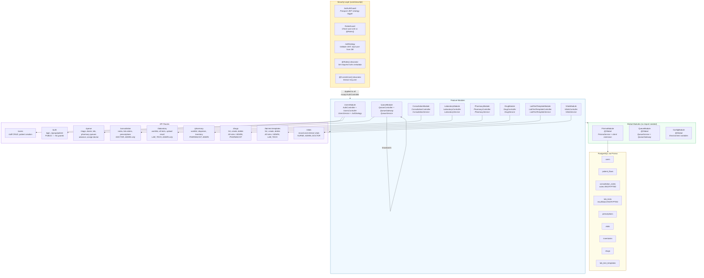

# Backend Module Architecture

## Module Dependency Summary

| Module | Depends On | Exports |
|--------|-----------|---------|
| **PrismaModule** | `@nestjs/config` | `PrismaService` (global) |
| **QueueModule** | `PrismaModule` | `QueueService`, `QueueGateway` (global) |
| **UsersModule** | `PrismaModule`, `JwtModule` | `UsersService` |
| **ConsultationModule** | `PrismaModule`, `QueueModule` | — |
| **LaboratoryModule** | `PrismaModule`, `QueueModule` | — |
| **PharmacyModule** | `PrismaModule`, `QueueModule` | — |
| **DrugModule** | `PrismaModule` | — |
| **LabTestTemplateModule** | `PrismaModule` | — |
| **VitalsModule** | `PrismaModule` | — |