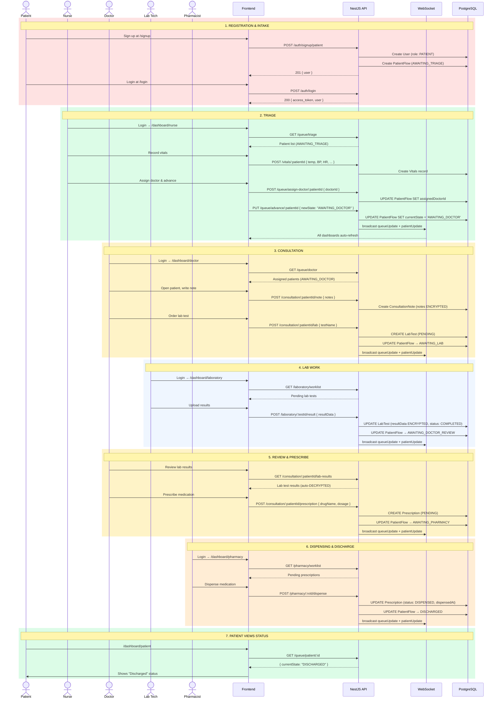

# End-to-End Patient Journey (Happy Path)

## Journey Summary

This diagram shows the complete happy path of a patient through the MedFlow system:

1. **Registration** → Patient signs up, system creates User + PatientFlow (AWAITING_TRIAGE)
2. **Triage** → Nurse records vitals, assigns doctor, advances to AWAITING_DOCTOR
3. **Consultation** → Doctor writes notes (encrypted), orders lab test, advances to AWAITING_LAB
4. **Lab Work** → Lab tech uploads results (encrypted), advances to AWAITING_DOCTOR_REVIEW
5. **Review & Prescribe** → Doctor reviews results, prescribes medication, advances to AWAITING_PHARMACY
6. **Dispensing** → Pharmacist dispenses medication, advances to DISCHARGED
7. **Patient View** → Patient checks their real-time status via WebSocket updates

Each state transition triggers a WebSocket broadcast so all connected clients auto-refresh.